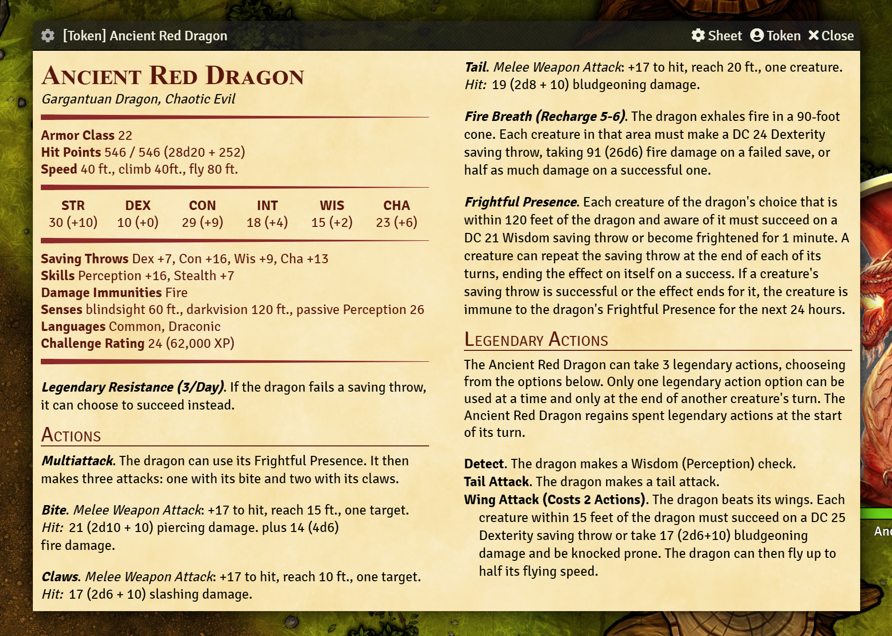
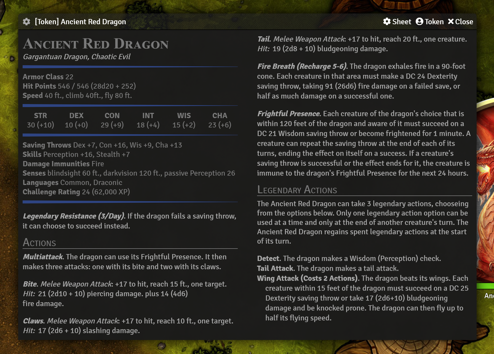

# Monster Blocks

Monster Blocks is an NPC sheet for FoundryVTT designed to faithfully reproduce the appearance of D&D 5e monster statblocks.

**Quick Settings** are accessed through the **cog menu in the upper left corner**. This menu gives access to key functions such as toggling certain features, and themes.



## Features
- Generate attack descriptions including hit bonus, damage formula, and average damage
- Generate spellcasting features for regular and innate casters based on their spellbook data
- Promote the Multiattack action to be displayed first, even if it isn't the first in the actor's list
- Present a concise view of all relevant game statistics as shown in official 5e books
- Optionally display an image of the creature for reference
- Optionally display "secret" blocks of feature descriptions inline rather than in boxes (useful for SRD monsters as they come with descriptions in secret boxes)
- Automatically sizes the window to fit the content of the statblock, meaning simple creatures automatically take up less space!
- Show or hide lair actions. Standard statblocks don't really include those, but since you can add them to the actor I made it possible to display them.
- Settings cog to toggle key features in the upper left corner.
- Rolls for ability checks, saving throws, skills, features, actions, and spells
- Open and edit features, spells, and other items by right-clicking their description
- Drag and drop items from the sheet to elsewhere
- Set default options in settings, and per-actor settings from the settings cog
- Support for Quick Insert
- Support for [Better Rolls for 5e](https://github.com/RedReign/FoundryVTT-BetterRolls5e) if installed.
- Per-monster theme selection to help differentiate them.<br>
	
	
- Custom theme support (see **Theme Customization**)
- Image pop-ups for creature artwork which can be shown to players
- Manage various features and items
- Edit skill and save proficiencies
- Manage or hide rolls for skills and saves that are not proficient

### Theme Customization

Custom CSS class names can be used as a theme. To customize your theme you can either use a module like
[Custom CSS](https://github.com/cswendrowski/FoundryVTT-Custom-CSS)
or a browser extension like [Stylish](https://chrome.google.com/webstore/detail/stylish-custom-themes-for/fjnbnpbmkenffdnngjfgmeleoegfcffe)
to target `.monsterblock.your-class-name` and modify the appearance however you like.

The following CSS variables define the most important values:
```CSS
--heading-color: rgb(89 23 13);
--roll-hover-color: hsl(8 70% 14% / 1);
--divider-color: rgba(140, 42, 42, 1);
--background-filter: hsl(39deg 100% 60% / 80%);
--background-blend: hard-light;
--main-text-color: black;
--inline-link-color: #ff6400;
--background-blend: hard-light;
--main-text-color: black;
```
## FAQ

### Q: How do I change the settings for specific monsters?
**A**: You can adjust the default settings in the Foundry module settings menu. The settings cog located in the upper left corner of the sheet next to the creature's name adjusts settings for each individual monster.

### Q. How do I edit avatar/character art?
**A**: Right click on the image.

### Q. How do I edit spells and features?
**A**: Right click on any feature, item, or spell to edit it.

### Q: Why can't I resize the window?
**A**: The window automatically calculates its own size. Any time the data in the sheet changes, the window size might need to change - even a few extra words in a description might mean it needs more space.
To avoid situations where a user custom-sizes the window, and then it either resizes itself, or content becomes invisible, I decided to just disable manual sizing.
I may be revisit this in the future.

### Q: What are "secret blocks" and how do those settings work?
**A**: Secret blocks are a feature of Foundry that allows some text to be "secret" for only the GM to see.
Typically, this text is displayed differently, in its own special box.
The SRD monsters included with Foundry 5e use this feature for all their attack descriptions, such that text like:
> Melee Weapon Attack, +17 to hit, reach 15 ft., one target. Hit: 21 (2d10+10) piercing damage.

Is contained in the secret block.
Monster Blocks has three ways to handle this type of text: normally, inline, or hidden.
You can configure this on a per-actor basis, and set the default under module settings.
As an example, this SRD entry for a Silver Dragon looks like this by default:


The text in the offset blocks is "secret" text. The text above it is generated by Monster Blocks, and the text below is part of the description that is *not* a secret.
Displayed *inline* we get this:


We lose the clear indication of what is or isn't a secret, but it looks more like a statblock. Of course, in this case, that text is repetitive. We can either hide the generated text that we don't need:


Or we can hide the secrets themselves:


You can choose how you want the sheet to appear for each actor, depending on need/preference.
By default, I leave secrets "normal" though my recommendation is to hide the ones for SRD monsters and use the generated text.
You can of course edit your monster to have/not have secret text in the description at all if that works better for you.
For monsters you create, you can just let Monster Blocks do all the work, and not bother typing out the attack and damage info yourself.

### Q: How can I roll from the sheet?
**A**: To ensure varisamilitude, the sheet doesn't show rollables in a big obvious way.
Inline rolls in feature descriptions are still marked with the d20 icon, but the built-in rolls of Monster Blocks are only indicated when moused over.
Monster Blocks supports rolling of abilities, saves, and skills, as well as the ability to send chat cards for features, spells, and actions.
Simply click on the name of any feature, action, or spell to send its chat card.
Monster Blocks also has "quick rolls" for attacks and damage in the generated descriptions.
The text such as "+17 to hit" and "Hit:  21 (2d10 + 10)" are rollables, and will directly roll 1d20+17, or 2d10+10 respectively.
Feature recharges, likewise, can be clicked to roll a d6 and the chat card will indicate whether or not the roll was high enough to charge the ability.
At this time, there isn't a semantic way to roll a save or skill that the creature is not proficient with, as these are not listed on the sheet.
In this case, you can simply roll the corresponding ability check.

If you have Better Rolls installed, most rolls from this sheet will use BRs custom rolls.

### Q: When I use [insert creature] something displays wrong!
**A**: Please let me know! I'm on the lookout for creatures that break the mold, so if you find something that doesn't work right please report it and I'll try to figure out how to handle it.

### Q: Does Monster Blocks support Lair Actions?
**A**: Yes! I have Lair Actions disabled by default, but you can configure this either by changing the default, or per-creature.
Technically, Lair Actions aren't part of monster statblocks, but since Foundry 5e treats them as monster features rather than location features, I did make it possible to show them.
They appear in their own section after Legendary Actions, in a bulleted list.

### Q: Some of the buttons on the title bar are missing! What do I do?
**A**: When the sheet only needs to be one column wide, the titlebar may not be able to fit the name of the monster and all the buttons.
This is much more of a problem if you have *lots* of other modules installed. A quick fix is to hide the labels on those buttons with Custom CSS:
```css
.window-app.monsterblock .window-header { font-size: 0px; padding-right: 30px; }
.window-app.monsterblock .window-header i { font-size: 14px; }
```
This will show only icons, which should help as long as you remember what they all do.


