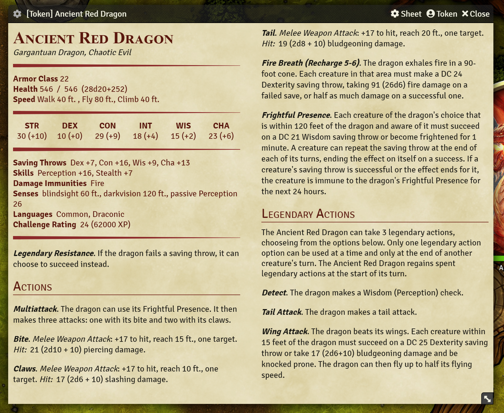

# Monster Blocks

An NPC sheet for FoundryVTT designed to faithfully reproduce the apperance of D&D 5e monster statblocks.

Currently does not support editing, this is a planned feature. See: [To Do List](todo.md)



## Features
 - Generate attack descriptions including hit bonus, damage formula, and average damage.
 - Generate spellcasting features for regular and innate casters based on the actor's spellbook data.
 - Promote the Multiattack action to be displayed first, even if it isn't the first in the actor's list.
 - Show a concise view of all the relavant game statistics as in oficial 5e books.
 - Optionally display an image of the creature for reference.
 - Optionally display the "secret" blocks of feature descriptions inline rather than in boxes (useful for SRD monsters as they come with descriptions in secret boxes).
 - Automatically set the size of the window to fit the content of the statblock, simple creatures automatically take up less space! (a little buggy)
 - Show or hide lair actions, standard statblocks don't really include those, but since you can add them to the actor I made it possible to display them.
 - Settings cog to toggle some features in the upper left corner.
 - Made it so that the [X Close] button can't get overflown off of the control bar (this effects all windows, not just this sheet).
 - Rolls for ability checks, saving throws, skills, features, actions, and spells.
 
## Helpful Macros
See [macros.js](macros.js)

### Toggle the selected token between the default 5e sheet, and MonsterBlock:
```
(async ()=> {
	await token.actor.sheet.close();
	if (token.actor.getFlag("core", "sheetClass") === "dnd5e.ActorSheet5eNPC") {
		await token.actor.setFlag("core", "sheetClass", "dnd5e.MonsterBlock5e")
	}
	else {
		await token.actor.setFlag("core", "sheetClass", "dnd5e.ActorSheet5eNPC")
	}
	await token.actor.sheet.render(true)
})();
```
