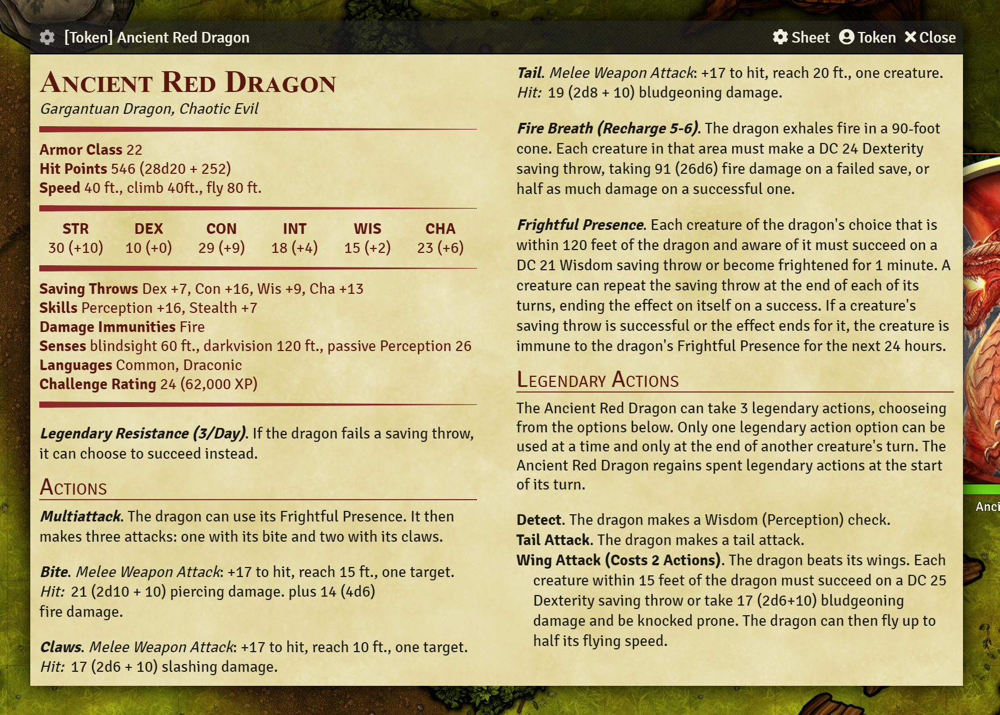
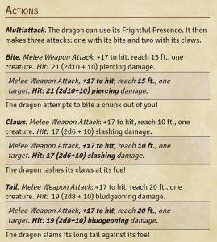
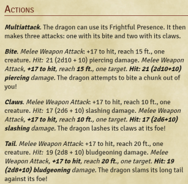
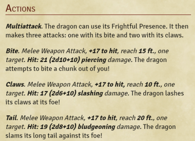

# Monster Blocks

An NPC sheet for FoundryVTT designed to faithfully reproduce the apperance of D&D 5e monster statblocks.

Does not support editing directly. You *can* edit features and other items by right clicking their descriptions. This sheet is intended for use as an in-game reference to a monster, *not* as a tool for building NPCs. See: [To Do List](todo.md)



## Features
 - Generate attack descriptions including hit bonus, damage formula, and average damage.
 - Generate spellcasting features for regular and innate casters based on the actor's spellbook data.
 - Promote the Multiattack action to be displayed first, even if it isn't the first in the actor's list.
 - Show a concise view of all the relavant game statistics as in oficial 5e books.
 - Optionally display an image of the creature for reference.
 - Optionally display the "secret" blocks of feature descriptions inline rather than in boxes (useful for SRD monsters as they come with descriptions in secret boxes).
 - Automatically set the size of the window to fit the content of the statblock, simple creatures automatically take up less space!
 - Show or hide lair actions, standard statblocks don't really include those, but since you can add them to the actor I made it possible to display them.
 - Settings cog to toggle some features in the upper left corner.
 - Made it so that the [X Close] button can't get overflown off of the control bar (this effects all windows, not just this sheet).
 - Rolls for ability checks, saving throws, skills, features, actions, and spells.
 - Open and edit features, spells, and other items by right-clicking their description.
 - Quick switch between this sheet and the default through the cog menu in the upper left.
 - Drag and drop items from the sheet to elsewhere.
 - Set default options in settings, and per-actor settings from the settings cog.

## FAQ

### Q: How do I change settings for a given monster?
**A**: You can adjust the default settings in the Foundry macro settings menu.
To adjust settings for each individual monster, there is a settings cog located in the upper left corner of the sheet next to the creature's name.
These options toggle various features on and off.

### Q: I can't edit anything, what's wrong?
**A**: Monster Blocks is a "read-only" sheet for the most part.
It is designed to show the vital information about a creature in a familiar way, while still giving the GM access to features like rolling, and while still being linked to the data for that creature's actor (as opposed to a book on your desk, or another reference outside of Foundry).
For monsters from the SRD, or imported from other sources, simply switching that actor to the Monster Blocks sheet and toggling the settings you want should be all you need to do.
For custom creatures and NPCs, I recommend using the default 5e sheet, or any other sheet of your choice, to build and design your creature... then switch it to Monster Blocks during your session for quick reference.
In the future, I intend to add limited editability, starting with hit points, but I don't plan to make Monster Blocks a fully editable sheet - of course, you are welcome to fork it and add feature, and I would be happy to accept pull requests if you do!

### Q: Switching sheets is annopying though...
**A**: Yep, that's why I added an option in the settings cog to quickly switch to default, and I added the same cog to the default sheet with a "Switch to Monster Blocks" option to make this as painless as possible.

### Q: What about my features and spells, can I edit those?
**A**: Yes! If you *right-click* on a feature or action description, or on the name of a spell, the item sheet for that item will be opened.
From there, you can edit that item as normal.

### Q: Why can't a resize the window?
**A**: Simple answer? Because getting it to automatically size itself to neatly contain the stats without being too large/small was challenging, and letting users adjust it might lead to unexpected behaviour.
The long answer is that, because it automatically calculates its own size, any time the data in the sheet changes, the size might need to change - even a few extra words in a description might mean it needs more space.
To avoid situations where a user has custom-sized the window, and then it either resizes itself, or content becomes invisible, I decided to just disable manual sizing.
I may revisit this in the future.

### Q: What are "secret blocks" and how do those settings work?
**A**: Secret blocks are a feature of Foundry that allows some text to be "secret" for only the GM to see.
Typically, this text is displayed a bit differently, in its own special box.
The SRD monsters included with Foundry 5e use this feature for all their attack descriptions, such that text like:
> Melee Weapon Attack, +17 to hit, reach 15 ft., one target. Hit: 21 (2d10+10) piercing damage.

Is contained in the secret block.
Monster Blocks has three ways to handle this type of text: normally, inline, or hidden.
You can configure this on a per-actor basis, and set the default under module settings.
As an example, this SRD entry for a Silver Dragon looks like this by default:



The text in the offset blocks is "secret" text. The text above it is generated by Monster Blocks, and the text below is part of the description that is *not* a secret.
Displayed *inline* we get this:



We lose the clear indication of what is or isn't a secret, but it looks more like a statblock.
Of course, in this case, that text is repetative. We can either hide the generated text that we don't need:



Or we can hide the secrets themselves:


You can choose how you want the sheet to appear for each actor, depending on need/preference. 
By default, I leave secrets "normal" though my recommendation is to hide the ones for SRD monsters and use the generated text.
You can of course edit your monster to have/not have secret text in the description at all if that works better for you.
For monsters you create, you can just let Monster Blocks do all the work, and not bother typing out the attack and damage info yourself.

### Q: How can I roll from the sheet?
**A**: To ensure varisamilitude, the sheet doesn't show rollables in a big obvious way.
Inline rolls in feature descriptions are still marked with the d20 icon, but the built-in rolls of Monster Blocks are only indicated when moused over.
Monster Blocks supports rolling of abilities, saves, and skills, as well as the ability to send chat cards for features, spells, and actions.
Simply click on the name of any feature, action, or spell to send its chat card.
Monster Blocks also has "quick rolls" for attacks and damage in the generated descriptions.
The text such as "+17 to hit" and "Hit:  21 (2d10 + 10)" are rollables, and will directly roll 1d20+17, or 2d10+10 respectively.
Feature recharges, likewise, can be clicked to roll a d6 and the chat card will indicate whether or not the roll was high enough to charge the ability.
At this time, there isn't a semantic way to roll a save or skill that the creature is not proficient with, as these are not listed on the sheet.
In this case, you can simply roll the corrisponding abillity check.

### Q: When I use [insert creature] something displays wrong!
**A**: Please let me know! I'm on the lookout for creatures that break the mold, so if you find something that doesn't work right plase report it and I'll try to figure out how to handle it.

### Q: Does Monster Blocks support Lair Actions?
**A**: Yes! I have Lair Actions disabled by default, but you can configure this either by changing the default, or per-creature.
Technically, Lair Actions aren't part of monster statblocks, but since Foundry 5e treats them as monster features rather than location features, I did make it possible to show them.
They appear in their own section after Legendary Actions, in a bulleted list.

## Helpful Macros
See [macros.js](macros.js)

### Toggle the selected token between the default 5e sheet, and MonsterBlock:
```
(async ()=> {
	await token.actor.sheet.close();
	if (token.actor.getFlag("core", "sheetClass") === "dnd5e.ActorSheet5eNPC") {
		await token.actor.setFlag("core", "sheetClass", "dnd5e.MonsterBlock5e")
	}
	else {
		await token.actor.setFlag("core", "sheetClass", "dnd5e.ActorSheet5eNPC")
	}
	await token.actor.sheet.render(true)
})();
```
